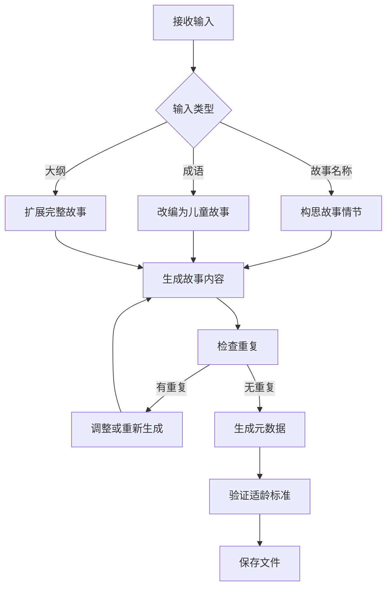

# 儿童故事生成技能

## 技能描述

该技能用于生成适合儿童阅读的故事，支持多种输入方式，自动生成符合项目规范的故事文件。

### 适用场景

- 根据故事名称生成完整故事
- 将成语改编为儿童故事
- 根据故事大纲扩展成完整故事
- 为特定年龄段定制故事内容

## 使用方法

### 命令格式

```
/bedbook:add-story <故事名称|成语|大纲> [选项]
```

### 输入类型

1. **故事名称**：直接提供故事标题，如"小兔子找太阳"
2. **成语**：提供成语，如"守株待兔"、"画蛇添足"
3. **故事大纲**：提供简短的故事梗概或主题描述

### 可选参数

- `--age <年龄段>`：指定目标年龄段，如 `--age 3-5岁`（默认：0-7岁）
- `--keywords <关键词>`：指定关键词，如 `--keywords 勇敢,友谊`

## 故事生成流程



## 质量标准

### 1. 重复检查

在生成故事前，必须检查现有故事库：

- **标题检查**：确保故事标题不与现有故事重复
- **主题检查**：避免与现有故事主题过于相似
- **内容检查**：确保情节有明显区别

### 2. 教育意义

每个故事应传递积极的价值观，包括但不限于：

- 勇敢、善良、诚实
- 友谊、互助、分享
- 责任、坚持、努力
- 爱护自然、尊重他人

### 3. 语言风格

- 使用简单、易懂的词汇
- 句子简短，节奏感强
- 多用拟声词和叠词，增加趣味性
- 避免生僻字和复杂句式

### 4. 情节设计

- 有明确的开头、发展、高潮、结尾
- 情节简单但不单调
- 设置适当的悬念或转折
- 结局积极正面

## 关键词生成规范

### 关键词数量

每个故事生成 **5-8 个关键词**。

### 关键词维度

从以下四个维度选择关键词：

| 维度 | 说明 | 示例 |
|------|------|------|
| **情感** | 故事传递的情感 | 温暖、快乐、感动 |
| **主题** | 故事的核心主题 | 成长、勇气、友谊 |
| **角色** | 故事中的角色类型 | 森林动物、小朋友 |
| **教育** | 教育意义类别 | 情商教育、品德培养 |

### 关键词示例

```
# 情感维度
温暖、快乐、感动、安心、幸福

# 主题维度
勇敢、友谊、成长、互助、守护、分享

# 角色维度
森林动物、小朋友、小精灵、小怪物

# 教育维度
情商教育、品德培养、生活常识、自然认知
```

## 适龄标准

### 0-3 岁

**语言特点**：
- 句子极短（5-10字为主）
- 大量重复句式
- 丰富的拟声词
- 简单的叠词

**情节特点**：
- 情节极其简单
- 无明显冲突
- 侧重感官体验
- 强调日常行为

**故事长度**：200-400 字

**示例关键词**：
```
age: 0-3岁
keywords:
  - 睡前故事
  - 亲子互动
  - 简单认知
  - 温馨
```

### 3-5 岁

**语言特点**：
- 句子较短（10-15字为主）
- 有一定重复性
- 适度使用形容词
- 简单的对话

**情节特点**：
- 情节简单但有发展
- 有小冲突和小解决
- 可加入简单悬念
- 强调因果关系

**故事长度**：400-700 字

**示例关键词**：
```
age: 3-5岁
keywords:
  - 好奇心
  - 探索
  - 小动物
  - 简单道理
```

### 5-7 岁

**语言特点**：
- 句子完整流畅
- 有一定描写性语言
- 对话更加丰富
- 可使用比喻等修辞

**情节特点**：
- 情节有起伏
- 有明确的冲突和解决
- 可有多条线索
- 强调角色成长

**故事长度**：600-1000 字

**示例关键词**：
```
age: 5-7岁
keywords:
  - 冒险
  - 成长
  - 友谊
  - 解决问题
```

## 文件命名规范

### 命名规则

```
<故事名称>.md
```

- 使用中文命名
- 不包含特殊字符
- 不添加序号前缀

### 示例

| 故事标题 | 文件名 |
|----------|--------|
| 小老虎怕下雨 | 小老虎怕下雨.md |
| 小鹿的温柔脚步 | 小鹿的温柔脚步.md |
| 守株待兔的新故事 | 守株待兔的新故事.md |

## 文件格式

```yaml
---
title: 故事标题
age: 3-7岁
keywords:
  - 关键词1
  - 关键词2
  - 关键词3
  - 关键词4
  - 关键词5
author: 作者名
category: 儿童故事
---

故事正文内容...
```

### 元数据字段说明

| 字段 | 类型 | 必填 | 说明 |
|------|------|------|------|
| `title` | string | 是 | 故事标题 |
| `age` | string | 是 | 适合年龄段 |
| `keywords` | string[] | 是 | 关键词列表（5-8个） |
| `author` | string | 是 | 作者名（使用当前模型名称，如 glm-5） |
| `category` | string | 是 | 故事分类（默认：儿童故事） |

## 验证清单

生成故事后，必须检查以下项目：

### 内容检查

- [ ] 故事标题与现有故事不重复
- [ ] 故事主题与现有故事有明显区别
- [ ] 故事内容符合目标年龄段
- [ ] 故事长度在适宜范围内
- [ ] 语言风格适合儿童阅读

### 格式检查

- [ ] YAML Front Matter 格式正确
- [ ] 所有必填字段已填写
- [ ] 关键词数量在 5-8 个之间
- [ ] 关键词覆盖四个维度
- [ ] 文件命名符合规范

### 质量检查

- [ ] 故事有明确的教育意义
- [ ] 故事结局积极正面
- [ ] 无不适当内容
- [ ] 无错别字和语病

## 故事模板

详细示例请参考 [story-examples.md](./examples/story-examples.md)

## 常见问题

### Q: 故事与现有故事主题相似怎么办？

A: 调整故事切入点或更换角色设定，确保情节有明显区别。例如，同样是讲"勇敢"的主题，可以从不同动物视角、不同场景切入。

### Q: 如何处理成语改编？

A:
1. 保留成语的核心寓意
2. 将抽象道理转化为具体故事
3. 使用拟人化的角色增加趣味性
4. 结尾可点明成语含义，帮助理解

### Q: 故事太长或太短怎么办？

A: 根据年龄段调整内容：
- 太长：删减次要情节，合并相似段落
- 太短：增加细节描写、对话或小插曲
